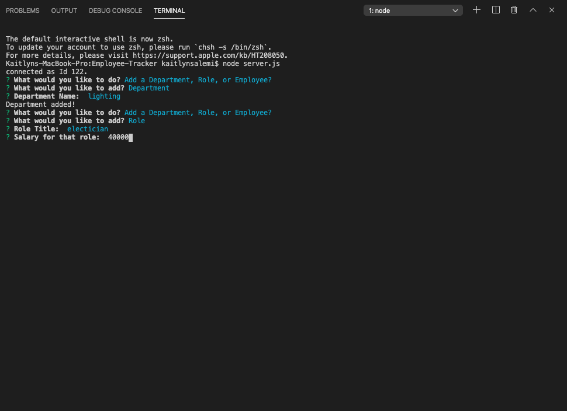

# Employee-Tracker

## Objective
To make a command line application that the user can use to sort through data. 

## Purpose
This is app is useful for managers, business owners, or anyone that needs to search for information in a database.

As a business owner
I want to be able to view and manage the departments, roles, and employees in my company
So that I can organize and plan my business

## Process
This is how the application works

The user is first asked what they would like to do. They can add a row to a table, view any table, or update a role. 

When the user chooses to add to a table they are given a list of all tables to choose from.

When Department is chosen for example, the user is then asked what department they would like to add. 

Department added! 

The app then circles back to the top and asks the user what they would like to do next. 

This time let's add a Role as an example. 

When the user chooses to add a Role they then need to type the Role title,

the Salary for the Role,

and the id for the Department in which the Role should belong.

Role added!

In addidtion to adding a Role and a Department the user can also add an Employee. 

Next, the user can view any table in the database. 

Let's see Department as example (note that you can also see the department that we added priviously).

Here is the Department table

Let's see the Employee table next

This is the Employee table

We can also update the Employee Roles

The user is asked the id of the Role they would like to update and the title of the Role they would like to change it to. 

Role updated!

